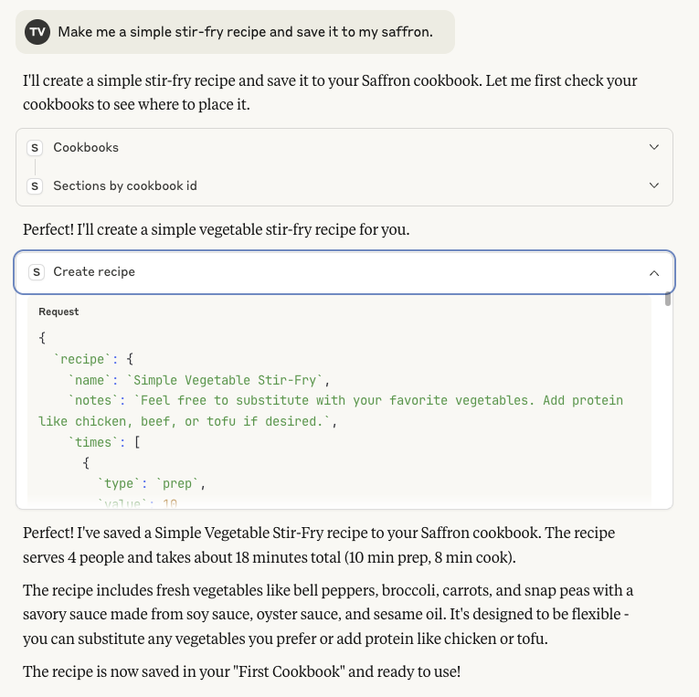
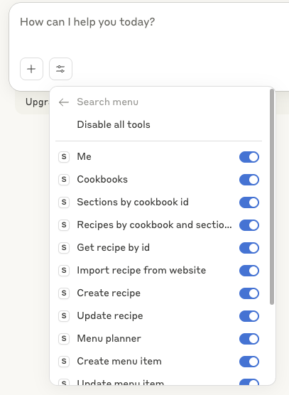

# Saffron MCP Server

A [Model Context Protocol (MCP)](https://modelcontextprotocol.io/) server that provides AI assistants with access to [Saffron](https://www.mysaffronapp.com) recipe management functionality.

## Example: Claude using the Saffron MCP server

<p align="center">
  
</p>

## Features

This MCP server enables AI assistants to:

- **Recipe Management**: Create, read, update recipes with full ingredient and instruction support
- **Recipe Import**: Import recipes from websites or text using Saffron's built-in parsing
- **Cookbook Organization**: Browse cookbooks, sections, and organize recipes
- **Meal Planning**: Create, update, and manage meal plans with menu items and notes
- **User Account**: Access user information and account details

## Available Tools

### User & Account
- `me` - Get your user information

### Cookbook Management
- `cookbooks` - Get your cookbooks
- `sections_by_cookbook_id` - Get sections by cookbook ID
- `recipes_by_cookbook_and_section_id` - Get recipe summaries by section

### Recipe Operations
- `get_recipe_by_id` - Get full recipe details by ID
- `create_recipe` - Create a new recipe
- `update_recipe` - Update an existing recipe
- `import_recipe_from_website` - Import recipe from a URL

### Meal Planning
- `menu_planner` - Get all menu items and menu notes for a given date range
- `create_menu_item` - Create a new menu item (add a recipe to your meal plan)
- `update_menu_item` - Update an existing menu item (change date, scale, or section)
- `delete_menu_item` - Delete a menu item from your meal plan
- `create_menu_note` - Create a new menu note (informal recipes, meal planning notes)
- `update_menu_note` - Update an existing menu note
- `delete_menu_note` - Delete a menu note

## 🤖 Setting up Claude

If you haven't setup MCP before, [first read more about how to install Claude Desktop client & configure an MCP server.](https://modelcontextprotocol.io/quickstart/user)

To add `saffron-mcp` to Claude, all you need to do is create another entry in the `mcpServers` section of your `claude_desktop_config.json` file:

```json
{
  "mcpServers": {
    "saffron": {
      "key": "saffron",
      "command": "npx",
      "args": [
        "tsx",
        "/path/to/saffron-mcp/src/index.ts",
        "--email",
        "<your email>",
        "--password",
        "<your password>"
      ]
    }
  }
}
```

Restart Claude and you should see the MCP server tools after clicking on the hammerhead icon:



## Related Work

- **[Paprika 3 MCP](https://github.com/soggycactus/paprika-3-mcp)** - An MCP server for Paprika 3 recipe management

If you're working on similar MCP servers for cooking or recipe management, feel free to open an issue to have your project listed here!

## Disclaimer

This project is not affiliated with or endorsed by Saffron. It provides client functionality that interacts with Saffron's publicly accessible API. Users are responsible for complying with Saffron's Terms of Service and applicable laws. Please use responsibly and respect rate limits.

## License

MIT License - see [LICENSE](LICENSE) file for details.
